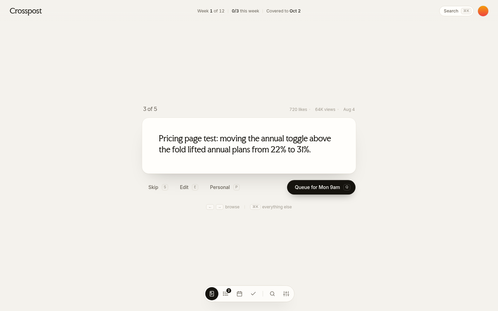

# Crosspost

Post on X. Show up on LinkedIn.

A free Chrome extension. When you post on X, it sends the same post to LinkedIn, images included. It also brings back your best old X posts on a simple schedule.

## What it does

- **Post once, show up twice.** Post on X like normal. A small preview pops up and the post goes to LinkedIn after a countdown, on your click, or instantly.
- **Your best old posts.** Import your X history and review your strongest unposted posts one at a time. Queue, skip or edit with one key.
- **A calendar that fills itself.** Pick your posting days. Empty slots get a suggested post.
- **Smart about personal posts.** Good-morning posts and weekend photos stay off LinkedIn.
- **Images carry over,** up to 9 per post. Or turn a text post into a clean card image.
- **Private by default.** No Crosspost server, no account. Your keys stay in your browser.

## Install (about 10 minutes, once)

1. Download the latest `crosspost-*.zip` from [Releases](../../releases) and unzip it somewhere permanent.
2. Open `chrome://extensions`, turn on **Developer mode**, click **Load unpacked** and pick the unzipped `crosspost` folder.
3. Create a free LinkedIn developer app and paste its Client ID and Secret into the settings page. The full walkthrough is in [extension/README.md](extension/README.md).
4. Click **Connect LinkedIn**, then import your X posts.

You need desktop Chrome, a LinkedIn account and a LinkedIn Company Page (LinkedIn requires one for developer apps). A Claude API key is optional, for rewrites and a smarter personal-post check.

## Privacy and security

See [SECURITY.md](SECURITY.md). In short: everything stays in Chrome's local storage on your machine and only goes to X, LinkedIn and, if you add a key, Anthropic.

## License

MIT. Made by the team behind Found. Fonts are under the SIL Open Font License.
